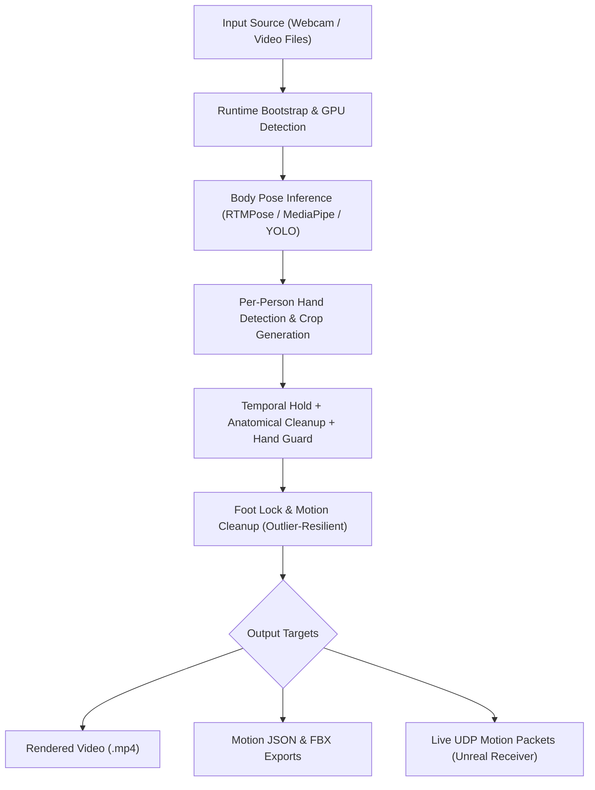

# Human Motion Tracking Pipeline (Kinara)


Kinara is a local video and webcam motion-tracking pipeline featuring RTMPose CUDA body tracking, MediaPipe pose and hand defaults, ONNX hand pose inference, and legacy YOLO pose tracking. It supports single-person tracking, single-camera multi-person tracking, multi-camera fused 3D triangulation, live UDP motion streaming for Unreal Engine receivers, and stack-safe export generation (JSON, FBX, rendered video).

> [!NOTE]
> Kinara includes a native Windows desktop launcher (`Kinara.exe`) with a customizable control-deck UI, built-in camera calibration workflows, 3D triangulation controls, and live stream previews.

---

## Quick Links & Documentation

- [Architecture & Data Flow](./docs/architecture.md) — Pipeline architecture, module map, and runtime object ownership.
- [Detailed Runtime Walkthrough](./docs/runtime-walkthrough.md) — Step-by-step story of execution from process launch to output export.
- [Backend Options Guide](./docs/backend-options.md) — RTMPose, WholeBody, MediaPipe, and legacy YOLO backend selection guide.
- [CLI Parameter Reference](./docs/cli-args.md) — Comprehensive reference for all command-line arguments and configuration flags.
- [Function & API Reference](./docs/function-reference.md) — Module-by-module symbol definitions and function contracts.

---

## Key Features

- **Multi-Backend Pose Tracking**: RTMPose (CUDA-accelerated), RTMPose WholeBody, MediaPipe, and legacy YOLO pose.
- **Robust Hand Tracking**: ONNX-based YOLO26 hand-pose model (FP16/FP32 variants), wrist-directed crop generation, temporal hold frames, synthetic anatomical fallbacks, and cross-person hand rejection.
- **Multi-Person Tracking**: Single-camera multi-person tracking with clothing color identity hints (`--identity person1=black,orange`).
- **Multi-Camera Fused 3D Reconstruction**: Calibrated multi-camera 3D joint triangulation using ChArUco camera calibration (`.toml`).
- **Anatomical Foot Locking & Motion Cleanup**: Outlier-resistant ground Y calculation and velocity spike suppression for planted foot contact without sliding.
- **Blender Motion Export & Import**: Automatic stack-safe JSON & FBX exports with normalized Z-up coordinate frames and Blender armature baking scripts.
- **Live UDP Streaming**: Low-latency UDP streaming of 3D joint maps, person IDs, and frame metadata for downstream game engines (e.g. Unreal Engine 5.4).
- **Native Desktop App**: Portable Windows launcher (`Kinara.exe`) built with PyWebView and standard control deck interface.

---

## Requirements

### Hardware
- Input: Webcam or local video files (`.mp4`, `.avi`, `.mov`, `.mkv`).
- GPU: NVIDIA GPU strongly recommended for CUDA-accelerated RTMPose, YOLO, and ONNX Runtime inference.
- Multi-Camera: 2 to 4 synchronized camera angles (optional for 3D triangulation).

### Software & Environment

| Tool / Dependency | Recommended Version | Purpose |
| --- | --- | --- |
| **Python** | `3.11.9` | Core pipeline runtime |
| **CUDA Toolkit** | `12.x` | NVIDIA GPU acceleration |
| **cuDNN** | `9.x` | PyTorch / ONNX Runtime backend library |
| **Unreal Engine** | `5.4` | Target real-time animation receiver |
| **Blender** | `4.x+` | Offline motion import and armature baking |

---

## Installation

### 1. Install Python 3.11
Download Python 3.11.9 from [python.org](https://www.python.org/downloads/). Enable **Add Python to PATH** during installation.

### 2. Configure NVIDIA Runtime (Optional but Recommended)
Install the latest NVIDIA Driver, CUDA Toolkit 12.x, and cuDNN 9.x. If ONNX Runtime reports a missing `cudnn64_9.dll`, ensure your cuDNN `bin` directory is added to `PATH`.

### 3. Clone Repository & Install Dependencies
```bash
git clone https://github.com/HrithvikM23/Kinara.git
cd Kinara

# Install dependencies for GPU inference:
pip install ultralytics torch torchvision numpy opencv-python onnxruntime-gpu rtmlib

# CPU-only fallback:
pip install ultralytics torch torchvision numpy opencv-python onnxruntime rtmlib
```

---

## System Architecture



---

## Tracking Backend Options

### Body Tracking
- **RTMPose (CUDA Recommended)**: High-speed, high-accuracy 17-point COCO body pose tracking via `rtmlib`.
  ```bash
  py app/main.py --source "video.mp4" --landmark-backend rtmpose --rtmpose-device cuda --rtmpose-mode balanced
  ```
- **RTMPose WholeBody**: Paired body and hand landmark inference (17 body joints + 21 keypoints per hand).
  ```bash
  py app/main.py --source "video.mp4" --landmark-backend rtmpose-wholebody --rtmpose-device cuda
  ```
- **MediaPipe Pose**: High-precision single-person tracking with 33 pose landmarks.
  ```bash
  py app/main.py --source "video.mp4" --landmark-backend mediapipe --model pose_landmark_full.tflite
  ```
- **Legacy YOLO Pose**: Ultralytics YOLO pose models (`yolo11x-pose.pt`, `yolo11l-pose.pt`, etc.) for comparative benchmarks.
  ```bash
  py app/main.py --source "video.mp4" --landmark-backend yolo --model yolo11x-pose.pt
  ```

### Hand Tracking
- **YOLO26 Hand Pose ONNX**: 21 3D hand keypoints per hand with `low`, `mid` (FP16) or `high`, `max` (FP32) precision presets.
- **MediaPipe Hands**: 21-point hand tracking model.

---

## Multi-Person & Multi-Camera Workflows

### Single-Camera Multi-Person Tracking
Track multiple individuals simultaneously using YOLO/RTMPose tracking IDs and optional clothing color hints to prevent identity swapping:
```bash
py app/main.py --source "multi_person.mp4" --max-people 2 --identity person1=black,orange --identity person2=gray,silver
```

### Multi-Camera 3D Triangulation
Reconstruct 3D skeletal joint trajectories from 2 to 4 synchronized camera angles using a ChArUco calibration TOML file:
```bash
# 1. Calibrate cameras using ChArUco calibration videos:
py app/main.py --calibrate-cameras --source "calib_cam0.mp4" --source "calib_cam1.mp4" --calibration-output "calibration.toml" --charuco-squares-x 11 --charuco-squares-y 8 --charuco-square-size 36

# 2. Run multi-camera fused 3D tracking:
py app/main.py --source "cam0.mp4" --source "cam1.mp4" --triangulate-3d --calibration-3d "calibration.toml" --sync-offset CAM_1=3
```

---

## Output Files & Stack-Safe Naming

All output runs are **stack-safe** and automatically append incrementing numeric run indices (`-1`, `-2`, `-3`, ...) to prevent accidental file overwrites:

- `outputs/<basename> rendered-1.mp4` — Processed video with optional skeleton overlay and FPS counter.
- `outputs/<basename> json-1.json` — Structured motion dataset containing 3D joint maps, confidence scores, and Blender rig metadata.
- `outputs/<basename> fbx-1.fbx` — Standard FBX 7.4 ASCII motion animation curves.
- `outputs/<basename> metadata-1.json` — Run configuration, performance benchmarks, and frame statistics.

### Blender Motion Import
Import Kinara JSON clips into Blender as animated armatures:
```bash
blender --python .\blender_kinematics\import_kinara_motion.py -- --input .\outputs\dance_json-1.json
```
For multi-person clips, select a specific person:
```bash
blender --python .\blender_kinematics\import_kinara_motion.py -- --input .\outputs\dance_json-1.json --person person1
```

---

## Desktop Launcher (`Kinara.exe`)

Kinara includes a standalone Windows desktop app:

```cmd
# Build standalone desktop launcher:
build.cmd
```

The compiled application folder will be placed at `artifacts/windows/Kinara/Kinara.exe`.

### UI Features
- **Control-Deck UI**: Splitter-resizable layout for live preview streaming and control panels.
- **Workflow Tabs**: Capture (Webcam), Files, Presets, Calibration, Triangulation, and Tune.
- **Runtime Dependency Installer**: One-click **Check Runtime** button to auto-prepare `.vendor_py311` dependencies and model weights.
- **Theme Switcher**: Dark mode and light mode toggle.

---

## Development Status

| Feature / Component | Status | Description |
| --- | --- | --- |
| Webcam & Video Input | **Complete** | OpenCV capture with automatic FPS fallback |
| RTMPose CUDA Body Tracking | **Complete** | Fast 17-point COCO body tracking via `rtmlib` |
| MediaPipe Body & Hand Tracking | **Complete** | Integrated TFLite pose & hand pipelines |
| ONNX Hand Pose Inference | **Complete** | YOLO26 hand-pose ONNX model (FP16 & FP32) |
| Clothing Color Identity Hints | **Complete** | Color similarity matching for multi-person tracking |
| Outlier-Resilient Foot Locking | **Complete** | 5th-percentile ground Y estimation & velocity filtering |
| Calibrated 3D Triangulation | **Complete** | Multi-camera reconstruction with ChArUco TOML calibration |
| Single & Multi-Person FBX Export | **Complete** | ASCII FBX 7.4 export with 4-tangent float curve specification |
| Motion JSON Export | **Complete** | Z-up normalized motion dataset with Blender rig metadata |
| Live UDP Streaming | **Complete** | Configurable host/port JSON streaming for Unreal receivers |
| Native Windows Desktop App | **Complete** | Standalone PyWebView launcher (`Kinara.exe`) |

---

## License

Kinara is licensed under the [MIT License](./LICENSE.md).
