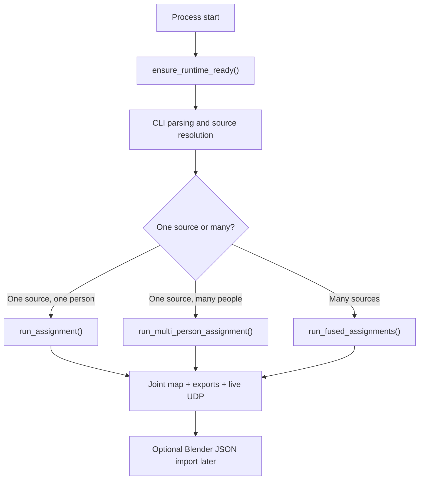
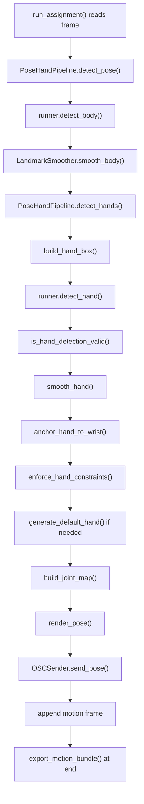
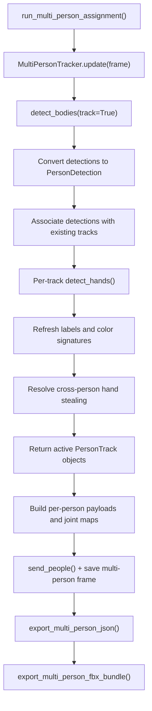
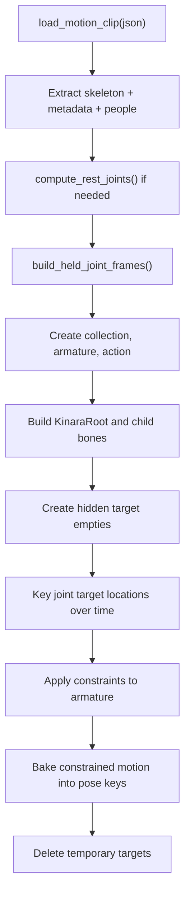

# Kinara Architecture And Data Flow

## Purpose

Kinara is a local motion-capture pipeline that starts with ordinary video frames and ends with three kinds of outputs:

- rendered preview or rendered MP4 for humans
- normalized motion JSON and FBX for downstream tools
- live UDP packets for runtime consumers such as Unreal-side receivers

The project is intentionally organized as a straightforward pipeline rather than a framework. Most of the important behavior lives in normal Python functions and small classes, so the fastest way to understand it is to follow the data as it moves from one module to the next.

This document explains that movement in detail.

## Reading Guide

If you are brand new to the repo:

1. Read this file first for the big picture.
2. Read [Detailed Runtime Walkthrough](./DETAILED_RUNTIME_WALKTHROUGH.md) next for a story-like execution trace.
3. Read [Function Reference](./FUNCTION_REFERENCE.md) when you need symbol-level detail.
4. Open `main.py`, then follow the call chains into `cli.py`, `runtime_config.py`, and `runners/`.

## System Goal

At a high level, Kinara does five jobs:

1. Acquire frames from one camera, many cameras, or a video file.
2. Detect body joints and hand joints.
3. Stabilize the landmarks so short failures do not explode the output.
4. Convert raw 2D landmarks into a named skeletal joint map.
5. Export or stream the result in formats that other tools can consume.

## Repository Map

| Module | Main responsibility | Consumes | Produces |
| --- | --- | --- | --- |
| `main.py` | Bootstrap and mode selection | CLI args, input sources | delegated runtime session |
| `cli.py` | CLI parsing and source selection | argv, interactive prompts | input assignments |
| `runtime_profiles.py` | Fastest/mid/quality tuning presets | parsed CLI namespace | profile-applied runtime knobs |
| `runtime_config.py` | Model prep and config validation | CLI namespace, source assignment | `PipelineConfig` |
| `runners/` | Single, multi-person, and fused loops | `PipelineConfig`, frames | rendered video, live packets, exports |
| `utils/bootstrap_*` | Startup dependency, CUDA, and environment checks | local Python environment | repaired process paths, install plan |
| `config.py` | Central runtime config and drawing constants | CLI-derived values | `PipelineConfig` |
| `camera/capture.py` | OpenCV capture and writer wrappers | webcam index or video path | frames, MP4 writer |
| `inference/rtmpose.py` | Body and hand model execution | frame, crop boxes, config | body detections, optional real foot points, hand points |
| `pipeline/pipeline.py` | Single-frame body+hand processing | frame, runner, smoother | body points, `hands_by_side`, overlay rendering |
| `network/osc_sender.py` | Live UDP transport | body points, hands, joints | JSON UDP packets |
| `utils/bootstrap_*.py` | Runtime environment setup | local filesystem, PATH, installed packages | prepared Python/runtime environment |
| `utils/normalize.py` | Hand crop geometry | wrist/elbow/body frame bounds | hand crop box |
| `utils/smoothing.py` | Temporal filtering and short hold | landmarks across frames | smoothed landmarks |
| `utils/body_constraints.py` | Soft body length constraints | body landmarks, learned limb lengths | steadier body landmarks |
| `utils/motion_cleanup.py` | Offline export cleanup and foot lock | exported joint frames | interpolated, smoothed, planted-foot motion |
| `utils/hand_fallback.py` | Hand plausibility and synthetic fallback | raw hand output, body wrist/elbow | accepted or generated hand |
| `utils/hand_constraints.py` | Anatomical cleanup | hand landmarks | cleaned hand landmarks |
| `utils/multi_person.py` | Single-camera multi-person tracking | detector results, frame | persistent person tracks |
| `utils/fusion.py` | Multi-camera projection and fusion | per-view people/landmarks | fused body/hands/depth |
| `utils/exports.py` | Joint building and export formats | body points, hands, fused depth | motion JSON, FBX data |
| `blender_kinematics/kinara_motion.py` | Blender-side JSON parsing/rest pose prep | Kinara JSON | `MotionClip` |
| `blender_kinematics/import_kinara_motion.py` | Blender armature import and bake | `MotionClip` | armatures, actions, baked animation |

## High-Level Runtime Layers

Kinara can be understood as six layers:

1. Environment bootstrap
2. Input resolution and configuration
3. Frame acquisition
4. Per-frame inference and stabilization
5. Optional multi-person or multi-camera orchestration
6. Export, live streaming, and Blender import



## Startup Sequence

### 1. Bootstrap happens before the CLI logic

`main.py` imports `ensure_runtime_ready()` and calls it immediately near the top of the file. That means the environment is repaired before argument parsing or model loading begins.

This is important because the project is designed to run on machines where:

- Python packages may not be installed globally
- CUDA or cuDNN may exist but not be on `PATH`
- ONNX Runtime may technically be installed but unable to find its GPU DLLs

### 2. What bootstrap actually does

`utils.bootstrap_dependencies.ensure_runtime_ready()` performs these steps:

1. Verifies the repo contains the files the runtime expects.
2. Creates local support directories such as `.vendor_py311` and `.ultralytics`.
3. Adds the local vendor directory to `sys.path`, `PYTHONPATH`, and the process environment.
4. Inspects the machine for NVIDIA runtime pieces:
   - `nvidia-smi`
   - CUDA bin directories
   - cuDNN bin directories
   - include directories for validation
   - `torch/lib` directories, because some GPU-capable installs ship the needed DLLs there
5. Prepends discovered runtime folders to `PATH`.
6. Registers discovered DLL directories with `os.add_dll_directory()` on Windows.
7. Probes required Python modules.
8. Installs any missing packages into the repo-local vendor directory.
9. Re-probes ONNX Runtime providers so the process knows whether `CUDAExecutionProvider` is really available.

### 3. Why the bootstrap layer exists

Without this step, Kinara would frequently fall back to CPU even on machines that already have a usable GPU runtime, because Windows DLL lookup is strict and many laptop setups do not expose cuDNN folders to the Python process automatically.

## Input Resolution And Mode Selection

### Source resolution

`resolve_sources()` converts raw CLI input into `InputAssignment` objects. Each assignment has:

- `label`: camera label such as `CAM_0` or `CAM_1`
- `source`: webcam index or file path

It supports:

- a single webcam: `--source 0`
- a single video: `--source path.mp4`
- labeled multi-camera input: `--source CAM_0=cam0.mp4 --source CAM_1=cam1.mp4`
- interactive prompt mode when `--source` is omitted

Unlabeled repeated sources are auto-labeled in input order as `CAM_0`, `CAM_1`, and so on. Geometry should come from calibration/sync data rather than names like front or left.

### Configuration construction

After sources are resolved, Kinara builds a `PipelineConfig`. This object is the shared contract between the entrypoint, model runner, tracker, pipeline, renderer, exporters, and live sender.

Key groups of config fields:

- model fields: body backend, hand backend, YOLO model path, MediaPipe pose model name/path, hand model preset, ONNX input names, input sizes
- detection thresholds: body confidence, IOU, hand detection and keypoint thresholds
- hand geometry fields: crop size, scale, forward shift, wrist offset tolerance
- smoothing fields: alpha values, hold-frame counts, confidence decay
- multi-person fields: maximum people, matching threshold, track hold frames, identity hints
- fused mode fields: calibration path and depth scale
- runtime/output fields: profile, preview flag, provider names, output directory, output filenames, UDP host/port, FourCC

### Mode switch

The main entrypoint chooses one of three top-level runtime paths:

- `run_assignment(config)` for single-source single-person
- `run_multi_person_assignment(config)` for single-source multi-person
- `run_fused_assignments(assignments, args)` for multi-camera fusion

The switch is based on:

- number of input assignments
- `config.max_people`

## Runtime Object Ownership

Understanding object ownership makes the control flow much easier to follow.

### Single-person run

One `run_assignment()` owns:

- one `VideoCaptureSession`
- one `ONNXPoseHandRunner`
- one `LandmarkSmoother`
- one `OSCSender`
- one `PoseHandPipeline`
- one list of `motion_frames`

### Single-camera multi-person run

One `run_multi_person_assignment()` owns:

- one `VideoCaptureSession`
- one shared `ONNXPoseHandRunner`
- one shared `OSCSender`
- one `MultiPersonTracker`
- many `PersonTrack` objects inside the tracker
- one `PoseHandPipeline` per active track
- one `LandmarkSmoother` per active track

### Multi-camera fused run

One `run_fused_assignments()` owns:

- one `VideoInputSource` per camera label
- one shared `ONNXPoseHandRunner`
- one `PoseHandPipeline` per camera for single-person fused mode
- one `MultiPersonTracker` per camera for fused multi-person mode
- one writer for the fused reference view
- one shared `OSCSender`
- one list of fused `motion_frames`

This design keeps the expensive model objects shared while keeping temporal state local to each tracked person or camera stream.

## Core Data Contracts

## Point

Most landmarks are represented as:

```python
Point = tuple[int, int, float]
```

Meaning:

- `x`: image-space horizontal coordinate
- `y`: image-space vertical coordinate
- `confidence`: model confidence

Important detail: body points and hand points remain in image space for most of the runtime. The project does not rush to convert them into world space. That conversion happens much later, mainly in export functions.

## Box

Bounding boxes use:

```python
Box = tuple[int, int, int, int]
```

Meaning:

- `x1, y1`: top-left corner
- `x2, y2`: bottom-right corner

## `hands_by_side`

The hand pipeline always returns a side-indexed dictionary:

```python
{
  "left": {
    "box": (x1, y1, x2, y2),
    "points": [Point, ...]
  },
  "right": {
    "box": (x1, y1, x2, y2),
    "points": [Point, ...]
  }
}
```

This object is the hand contract used by:

- the renderer
- the UDP sender
- the export layer
- the fusion layer
- the multi-person tracker

## Body detection

`ONNXPoseHandRunner.detect_bodies()` returns body detections with:

- detector or tracker id
- confidence score
- person box
- 17 YOLO body keypoints

These raw body detections are still detector-shaped data, not skeletal export data.

## Joint map

`utils.exports.build_joint_map()` converts body points and hand points into a named skeleton:

```python
{
  "HipsRoot": {"x": float, "y": float, "z": float, "confidence": float},
  "LeftHip": {...},
  "Chest": {...},
  "Neck": {...},
  "Head": {...},
  "LeftThumb1": {...},
  "RightPinky4": {...}
}
```

The joint map is the project's canonical export-space skeleton.

### Why the joint map matters

The same joint map feeds:

- motion JSON export
- FBX export
- multi-camera fused outputs
- live UDP packets when joints are included
- Blender import metadata and playback

That means `build_joint_map()` is one of the most important normalization steps in the whole repo.

## Motion frame schemas

### Single-person frame

```python
{
  "frame_index": int,
  "joints": JointMap,
}
```

### Multi-person frame

```python
{
  "frame_index": int,
  "people": [
    {
      "id": int,
      "label": str,
      "box": Box | None,
      "score": float | None,
      "camera_views": list[str],
      "body_points": list[Point],
      "hands_by_side": dict[str, dict],
      "joints": JointMap,
    }
  ]
}
```

### Live UDP schema

`OSCSender` sends compact JSON with:

- packet format name
- metadata such as frame index and mode
- one or more people
- per-person body points
- per-person hand boxes and points
- optional joint map

The UDP payload is designed to be operational data, not archival data. JSON export is the archival path.

## Single-Person Frame Flow

This is the simplest execution path and the best one to study first.



### Detailed explanation

1. `VideoCaptureSession.read()` supplies the next frame.
2. `PoseHandPipeline.detect_pose()` asks the body model for one body.
3. The body landmarks are smoothed through `LandmarkSmoother.smooth_body()`.
4. If the body is missing, the pipeline falls back to a zeroed 17-point list so downstream code keeps a consistent shape.
5. `detect_hands()` loops over left and right wrists.
6. `build_hand_box()` uses the wrist-to-elbow vector to place a square crop slightly forward of the wrist.
7. `detect_hand()` runs the ONNX hand model on that crop.
8. `is_hand_detection_valid()` rejects implausible outputs.
9. `smooth_hand()` stabilizes the hand and can temporarily hold older points when the new detection is weak.
10. `anchor_hand_to_wrist()` shifts the hand so landmark 0 aligns exactly with the body wrist.
11. `enforce_hand_constraints()` corrects lengths, bend limits, and finger-lane separation.
12. If the hand is still invalid, `generate_default_hand()` creates a synthetic but anatomically stable hand from the wrist-elbow direction.
13. `build_joint_map()` creates the full named skeleton.
14. `render_pose()` draws body and hands.
15. `send_pose()` optionally emits a live packet.
16. The frame's joint map is appended to `motion_frames`.
17. After the loop finishes, `export_motion_bundle()` writes normalized JSON and FBX.

## Single-Camera Multi-Person Flow

Single-camera multi-person mode adds one major concept: persistent tracks.



### What changes compared with single-person mode

- The body detector runs in tracking mode so it can preserve tracker ids when possible.
- Each track owns its own `PoseHandPipeline` and `LandmarkSmoother`.
- Hands are detected per track, not globally.
- People can keep a short-lived track state even if a detection disappears for a few frames.
- Color signatures help stabilize identity hints such as `person1=orange`.

### Track association logic

`_associate_tracks()` works in layers:

1. Preserve direct tracker-id matches first when available.
2. Score unmatched track/detection pairs using:
   - IOU
   - center distance
   - size similarity
   - clothing color similarity
   - optional identity-hint bonus
3. Accept high-scoring pairs.
4. Carry forward recently missing tracks for a limited hold period.
5. Create new tracks for leftover detections.

### Cross-person hand guard

Crowded scenes often cause one person's wrist crop to capture another person's hand. `_resolve_cross_person_hands()` compares the detected hand against all active tracks and checks which body it most likely belongs to. If the hand seems stolen, the current owner receives a generated fallback hand instead of keeping obviously wrong landmarks.

## Multi-Camera Fused Flow

Fused mode is the most orchestration-heavy path in the repo.

### Reference-view design

One camera is treated as the reference output view:

- the first provided camera label, usually `CAM_0`

The reference view matters because:

- the rendered fused canvas is based on that frame
- projected points are expressed in that view's coordinate frame before export normalization
- grouped people are aligned against tracks seen in that view

The intended direction is to make reference selection confidence/calibration-driven after camera health and calibration metadata are available.

### Single-person fused mode

For each camera:

1. Run one camera-local `PoseHandPipeline`.
2. Collect body points and hands from each view.
3. `fuse_body_views()` projects each body into a common reference frame and averages each keypoint with confidence weighting.
4. `fuse_hand_views()` performs the same process per hand side.
5. `estimate_joint_depths()` estimates pseudo-depth from lateral displacement across calibrated camera views.
6. `build_joint_map()` creates a joint map with X/Y plus estimated depth.
7. Render and export the fused result.

### Fused multi-person mode

For each camera:

1. Run a full `MultiPersonTracker`.
2. Group tracks across cameras with `align_people_across_cameras()`.
3. For each grouped person:
   - collect body points per camera
   - collect hands per camera
   - fuse body and hands
   - estimate depth
   - build a joint map
4. Render the grouped result on the reference canvas.
5. Send and export one fused multi-person motion timeline.

### Calibration role

`utils.fusion.load_camera_calibrations()` accepts lightweight calibration JSON keyed by source labels such as `CAM_0` and `CAM_1`. That path is a practical pseudo-depth system that uses configured camera orientation and relative lateral displacement to estimate depth-like values good enough for export and retarget experimentation. Cameras without calibration data use neutral depth settings.

For fused runs, Kinara can also load a calibrated camera TOML with `--triangulate-3d --calibration-3d`. In that mode, Kinara keeps its YOLO body and ONNX hand detections, stores matched per-camera 2D landmarks for the run, triangulates them after the frame loop, and replaces heuristic fused joint coordinates with calibrated 3D coordinates where reconstruction succeeds.

## Joint Construction And Export Normalization

The export layer is where Kinara stops being “detector output” and becomes “motion data”.

### Step 1. Build the skeleton

`build_joint_map()` fills the Kinara skeleton in three ways:

- direct body joint mapping from YOLO indices
- derived joints such as `HipsRoot`, `Chest`, `Neck`, and `Head`
- derived foot and toe joints from knee-to-ankle direction
- hand joints from left and right hand landmarks

### Step 2. Normalize the timeline

Before JSON and FBX export, frames are normalized by helpers in `utils.exports`:

1. `_ground_joint_frames()` moves the pose timeline so the subject stands on a common floor plane.
2. `_z_up_joint_frames()` swaps axes into Kinara's declared Z-up export space.
3. `_ground_z_axis_frames()` re-grounds the final Z-up result.

### Step 3. Build metadata

`_build_export_metadata()` adds:

- skeleton hierarchy
- declared coordinate system
- stable rest joints
- any mode-specific metadata passed in by the runtime loop

### Step 4. Write formats

- `export_motion_json()` writes `kinara-motion-json-v1`
- `export_multi_person_json()` writes `kinara-multi-person-json-v1`
- `export_motion_fbx()` writes the current lightweight FBX translation-curve format
- `export_multi_person_fbx_bundle()` splits multi-person clips into one FBX per person

### Why JSON is the Blender source of truth

The FBX writer is still useful, but its animation representation is translation-centric. Blender armatures behave much better when the importer can reconstruct a stable rest pose and drive bone rotation from explicit joints. That is why the Blender workflow uses motion JSON plus metadata rather than trusting the FBX path.

## Blender Import Flow

The Blender importer in `blender_kinematics` is a separate runtime that consumes Kinara JSON after capture.



### Why the importer works

The importer intentionally does not rebuild edit bones every frame. Instead it:

- computes one stable rest rig
- creates one target object per joint
- keys the targets across frames
- uses constraints to make bones follow those targets
- bakes the result into a real Blender action

This avoids the common “all bones translate independently” failure mode that breaks retargetable armatures.

### Rest pose strategy

If `metadata.rest_joints` already exists in the JSON, Blender can use it directly. Otherwise `compute_rest_joints()` on the Blender side estimates stable median parent-to-child offsets from the clip.

This keeps:

- bone lengths fixed
- noisy first frames from corrupting the whole rig
- missing frames from collapsing the skeleton

### Missing-data strategy

`build_held_joint_frames()` carries the last valid joint value forward when a frame is weak or missing. The importer never intentionally snaps a joint to the origin just because one frame is unreliable.

## Coordinate Systems

### Image space

Inference and rendering begin in OpenCV image space:

- origin: top-left corner
- positive X: right
- positive Y: down

### Kinara export space

`utils.exports` converts the landmarks into a normalized motion space:

- X remains horizontal
- image-space vertical motion is inverted and later becomes Z-up motion
- fused pseudo-depth becomes the forward axis
- the final declared metadata says:
  - right axis = `X`
  - forward axis = `Y`
  - up axis = `Z`

### Blender import assumption

The Blender importer assumes Kinara JSON is already in the declared normalized Z-up space. It does not reinterpret the data as raw pixel coordinates.

## Failure Handling And Recovery Strategy

Kinara prefers stable output over perfect detector purity. Several modules actively choose “reasonable continuity” instead of dropping data.

### Examples

- Missing body detection: the pipeline returns a zero-shaped body array so downstream code stays structurally valid.
- Brief landmark loss: `LandmarkSmoother` holds the last confident point for a short number of frames.
- Bad hand detection: the hand is rejected and replaced by a generated fallback hand.
- Multi-person hand stealing: the wrong hand is discarded and replaced by a fallback on the incorrect owner.
- Missing Blender frame joints: the importer reuses the last valid joint rather than collapsing to origin.
- No export frames: export helpers simply do nothing.

This makes the system practical for long clips and imperfect real-world footage.

## Extension Points

If you need to change the project, these are the best entry points.

### Add or replace a body model

- start in `utils/model_assets.py`
- update `prepare_model_assets()` in `runtime_config.py`
- use `--model yolo11n-pose.pt` for YOLO mode or `--model pose_landmark_full.tflite` for MediaPipe mode
- keep `ONNXPoseHandRunner.detect_bodies()` returning the existing body-detection contract

### Change hand crop behavior

- start in `utils/normalize.py`
- then inspect `PoseHandPipeline.detect_hands()`

### Change temporal behavior

- start in `utils/smoothing.py`
- inspect `utils/body_constraints.py` for limb-length stabilization
- then inspect the thresholds in `PipelineConfig`

### Change person matching

- start in `utils/multi_person.py`
- most matching behavior lives in `_match_score()` and `_associate_tracks()`

### Improve 3D fusion

- start in `utils/fusion.py`
- keep the output compatible with `build_joint_map()`

### Change export skeleton or metadata

- start in `utils/exports.py`
- keep Blender-side parsing in `blender_kinematics/kinara_motion.py` in sync

## Why The Architecture Is Structured This Way

The design is intentionally conservative:

- simple module boundaries
- explicit data contracts
- detector output stays close to image space until export needs a richer representation
- Single-camera exports stay flat in depth by default; MediaPipe world-landmark relative Z is available only when `--single-camera-depth mediapipe` is selected
- `--processing-width` can downscale the inference frame for speed while preserving original-size rendered output
- temporal state is owned locally by the object that needs it
- exporters are downstream of stabilization, not mixed into inference
- Blender import is decoupled from capture-time runtime decisions

The result is easier to debug than a deeply abstracted system because each stage has a narrow responsibility and a visible input/output shape.

## Recommended Reading Order In Source

1. `main.py`
2. `cli.py`
3. `runtime_config.py`
4. `runners/`
5. `config.py`
6. `pipeline/pipeline.py`
7. `inference/rtmpose.py`
8. `utils/smoothing.py`
9. `utils/hand_fallback.py`
10. `utils/hand_constraints.py`
11. `utils/multi_person.py`
12. `utils/fusion.py`
13. `utils/exports.py`
14. `utils/skeleton.py`
15. `blender_kinematics/kinara_motion.py`
16. `blender_kinematics/import_kinara_motion.py`
